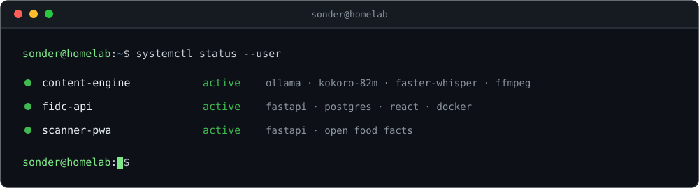

  
  
  

  

  
  
  

## Sobre

Prefiro rodar as coisas na minha própria máquina. Geração de texto, voz e transcrição rodam local numa 3090 aqui em casa antes de eu cogitar uma API paga. O que precisa ficar de pé 24h vai pra uma VPS minha, em Docker.

Na prática eu tiro trabalho repetitivo da frente: sistema de gestão em produção pra uma empresa, pipeline de vídeo que monta sozinho, scanner de código de barras que minha mãe usa no mercado.

> A maior parte do código está em repositórios privados (produção e trabalho de cliente).

## Stack

<table>
<tr>
<td><b>Backend</b></td>
<td>    </td>
</tr>
<tr>
<td><b>Frontend</b></td>
<td>  </td>
</tr>
<tr>
<td><b>Infra</b></td>
<td>  </td>
</tr>
<tr>
<td><b>IA &amp; mídia</b></td>
<td>  </td>
</tr>
</table>

## Projetos

<table>
<tr>
<td width="50%" valign="top">

**Gestão de garantias (FIDC)** 
`privado` · em produção

Modelagem de garantias N:N sem quebrar o histórico de auditoria que já existia rodando, mais permissões por perfil de usuário.

`FastAPI` `SQLAlchemy async` `PostgreSQL` `React` `Docker`

</td>
<td width="50%" valign="top">

**content-engine** 
`privado` · em desenvolvimento

Pipeline de vídeo ponta a ponta com tudo rodando local: roteiro, narração, legenda e montagem, sem chamar API paga em nenhuma etapa.

`Ollama` `Kokoro-82M` `faster-whisper` `FFmpeg` `Redis`

</td>
</tr>
<tr>
<td width="50%" valign="top">

**Scanner nutricional (PWA)** 
`privado` · em uso

Leitor de código de barras que consulta a Open Food Facts e devolve a informação nutricional no meio do corredor do mercado.

`FastAPI` `PWA` `Open Food Facts API`

</td>
<td width="50%" valign="top">

**MOBA em Roblox** 
`privado` · projeto de faculdade

Clone de LoL em Lua: movimentação por clique, sistema de habilidades, torres, minions, economia e um gerador de mapa programático.

`Lua` `Roblox` `Blender`

</td>
</tr>
</table>

**Também já construí:** sites institucionais em produção, servidor de Minecraft self-hosted em Docker, automações em n8n e infra de acesso remoto com Tailscale.

  <a href="https://kaueprata.com">kaueprata.com</a>

  github.com/sonderzudo-lab

